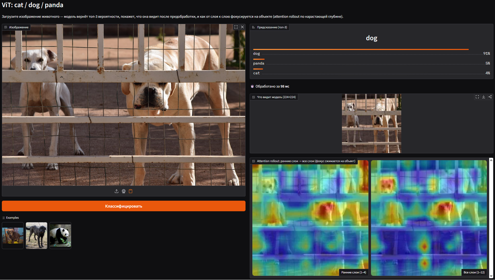
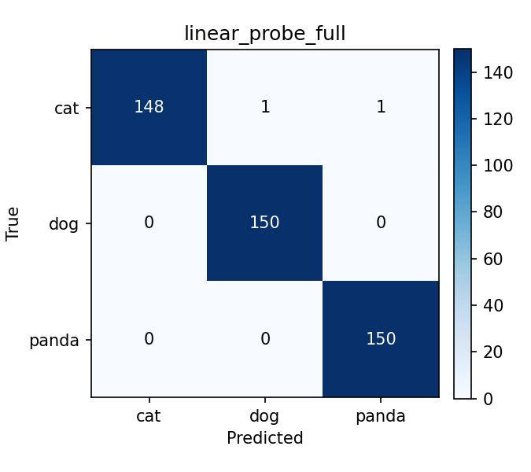

# vit-image-classifier

[](https://github.com/VllSunday/vit-image-classifier/actions/workflows/ci.yml)
[](https://www.python.org/)
[](LICENSE)



Дообучение Vision Transformer (`google/vit-base-patch16-224`) на три класса:
cat / dog / panda.

Базовые кубики ViT (patch embedding, токен `[CLS]`, позиционные эмбеддинги
и классификационная голова) написаны руками поверх предобученного энкодера.
К проекту приложено небольшое демо на Gradio.

## Быстрый старт

Без обучения и без датасета — веса тянутся с Hugging Face Hub:

```bash
docker build -t vit-classifier .
docker run -p 7860:7860 vit-classifier   # http://localhost:7860
```

## Что умеет

- препроцессинг (ресайз 224×224 + нормализация RGB)
- patch embedding руками (патчи 16×16), токен `[CLS]`, позиционные эмбеддинги
- transfer learning на предобученном vit-base-patch16-224
- обучение с mixed precision, косинусным LR с warmup и логами в TensorBoard
- оценка: accuracy, F1 по классам, confusion matrix
- демо на Gradio: топ-3 вероятности и attention rollout по слоям

## Структура

```
vit-image-classifier/
├── data/                       # датасет (не в гите)
├── scripts/
│   ├── download_data.py        # скачать датасет с Kaggle
│   └── run_experiments.py      # обучить + оценить обе стратегии, собрать таблицу
├── src/
│   ├── data/
│   │   ├── dataset.py          # загрузка + сплит train/val/test
│   │   └── transforms.py       # препроцессинг + аугментации
│   ├── models/
│   │   ├── patch_embedding.py  # патчи + CLS + позиционные
│   │   ├── vit.py              # вся модель: свои части + backbone + голова
│   │   └── encoder_from_scratch.py  # Transformer-энкодер руками, для разбора
│   ├── config.py               # гиперпараметры
│   ├── train.py                # цикл обучения
│   ├── evaluate.py             # метрики на тесте
│   └── inference.py            # предсказание по одной картинке (для демо)
├── app/
│   └── app.py                  # демо на Gradio
├── reports/                    # confusion matrix + таблица результатов
├── tests/                      # pytest
├── checkpoints/                # веса (не в гите)
├── runs/                       # логи TensorBoard (не в гите)
├── Dockerfile
└── README.md
```

## Датасет

[Animal Image Dataset (DOG, CAT and PANDA)](https://www.kaggle.com/datasets/ashishsaxena2209/animal-image-datasetdog-cat-and-panda) — 3000 картинок, по 1000 на класс.

Скачать скриптом (нужен токен Kaggle API, см. [доку kagglehub](https://github.com/Kaggle/kagglehub#authenticate)):

```bash
python scripts/download_data.py
```

Скрипт раскладывает картинки в `data/cat`, `data/dog`, `data/panda`. Если токена
Kaggle нет — скачай архив по ссылке руками и разложи так же.

## Установка

```bash
python -m venv .venv
.venv\Scripts\activate        # Windows
# .venv/bin/activate          # Linux / macOS
```

PyTorch ставится отдельно, сборка зависит от железа:

```bash
# NVIDIA GPU (CUDA 13.2)
pip install torch torchvision --index-url https://download.pytorch.org/whl/cu132
# только CPU
pip install torch torchvision --index-url https://download.pytorch.org/whl/cpu
```

Дальше остальное:

```bash
pip install -r requirements.txt          # только runtime
pip install -r requirements-dev.txt      # + линтер / форматтер / тесты
```

## Разработка

```bash
pre-commit install     # ruff + black на каждый коммит
ruff check .
black .
pytest
```

Те же проверки гоняются в CI на каждый push и PR.

## Запуск

```bash
# обучение (по умолчанию linear probing, остальные опции в --help)
python -m src.train --strategy linear_probe --epochs 5
python -m src.train --strategy gradual_unfreeze --unfrozen-layers 4 --epochs 5

# оценка чекпойнта на тесте (accuracy, F1 по классам, confusion matrix)
python -m src.evaluate --checkpoint checkpoints/linear_probe_best.pt

# прогнать всё сравнение экспериментов
python scripts/run_experiments.py

# демо
python app/app.py
```

Демо берёт `checkpoints/linear_probe_best.pt`, если он есть, иначе качает веса
с Hugging Face Hub (`A11Sunday/vit-cat-dog-panda`) и кеширует — обучать ничего
не надо. Локальный путь переопределяется через `CHECKPOINT`, репозиторий на
Hub — через `HF_REPO_ID`. Вход модели строго `(Batch_Size, 3, 224, 224)`.

### Предобученные веса

Дообученный чекпойнт лежит на Hugging Face Hub:
[`A11Sunday/vit-cat-dog-panda`](https://huggingface.co/A11Sunday/vit-cat-dog-panda),
подтягивается сам при первом запуске. Чтобы выложить свой:

```bash
hf auth login                                              # токен с правами на запись
python scripts/push_to_hub.py --repo-id A11Sunday/vit-cat-dog-panda
```

Логи обучения в TensorBoard:

```bash
tensorboard --logdir runs
```

### Docker

```bash
docker build -t vit-classifier .
docker run -p 7860:7860 vit-classifier      # http://localhost:7860
```

Обучение и локальные веса не нужны: при первом старте контейнер сам качает
чекпойнт с Hub. Другой репозиторий — `-e HF_REPO_ID=...`, свой чекпойнт —
смонтировать и задать `-e CHECKPOINT=...`.

## Результаты

Сравниваю две стратегии дообучения, каждую в двух режимах — полный трейн
(~2100 картинок) и маленький (~150), плюс baseline с нуля (та же архитектура
без предобученных весов). Тест всегда один и тот же — 450 картинок, по 150
на класс.

| Эксперимент | Предобучен | Обучаемых параметров | Эпох до лучшего | Test accuracy | Macro F1 |
|---|:---:|---:|---:|---:|---:|
| Linear probe (полные данные) | да | 2 307 | 3 | 0.9956 | 0.9955 |
| Gradual unfreeze (полные данные) | да | 28 355 331 | 1 | 0.9933 | 0.9933 |
| Linear probe (маленький трейн) | да | 2 307 | 3 | 0.9933 | 0.9933 |
| Gradual unfreeze (маленький трейн) | да | 28 355 331 | 3 | 0.9933 | 0.9933 |
| С нуля (без предобучения) | нет | 85 800 963 | 17 | 0.6689 | 0.6647 |



Предобученный ViT и так почти идеально разделяет cat / dog / panda (в ImageNet,
на котором учился backbone, уже есть кошки, собаки и «giant panda»), поэтому все
варианты с transfer learning упираются в ~99%.

Основную работу делает именно transfer learning: та же архитектура с нуля на тех
же данных вытягивает только ~67% — разрыв в ~32 пункта, ради которого и берут
предобученный backbone вместо обучения своего.

Раз задача для предобученной модели лёгкая, linear probing выигрывает по
эффективности: та же точность при 2 307 обучаемых параметрах против 28M. Даже на
маленьком трейне (~50 картинок на класс) предобученная модель держит ~99%, а
модели с нуля данных не хватает — ViT-ам нужно много.

Confusion matrix по каждому прогону лежат в [`reports/`](reports/).

## Энкодер с нуля (для себя)

В основной модели стек блоков Transformer Encoder я беру готовым из transformers
(`backbone.layers`). Чтобы он не оставался для меня чёрным ящиком, в
[`src/models/encoder_from_scratch.py`](src/models/encoder_from_scratch.py) я
расписал его сам, без библиотеки: scaled dot-product attention, многоголовое
самовнимание, позиционный MLP, pre-norm блок и весь стек с финальным LayerNorm.

Модуль самодостаточный и в пайплайн не встроен — это разбор темы. Быстрая
самопроверка форм:

```bash
python -m src.models.encoder_from_scratch   # OK: (2, 197, 768)
```

## Стек

PyTorch, torchvision, Hugging Face Transformers, Gradio, TensorBoard, scikit-learn
